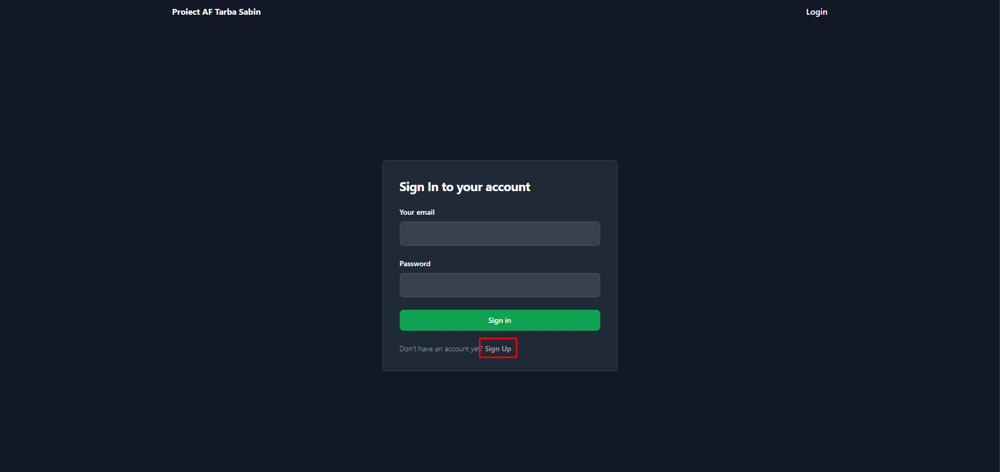
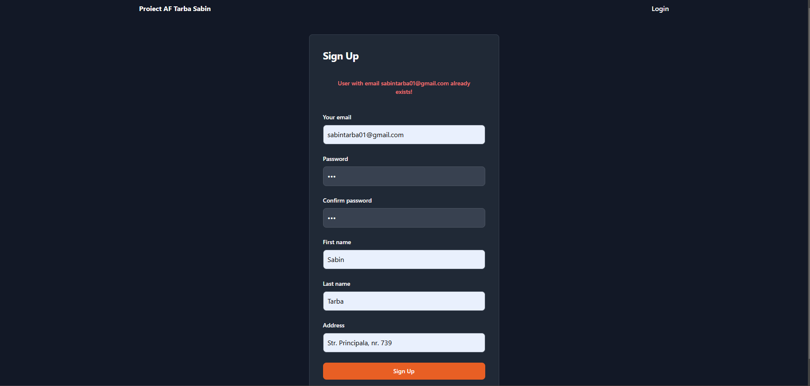
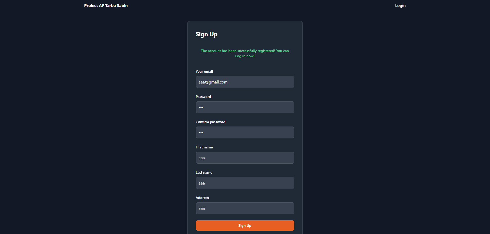
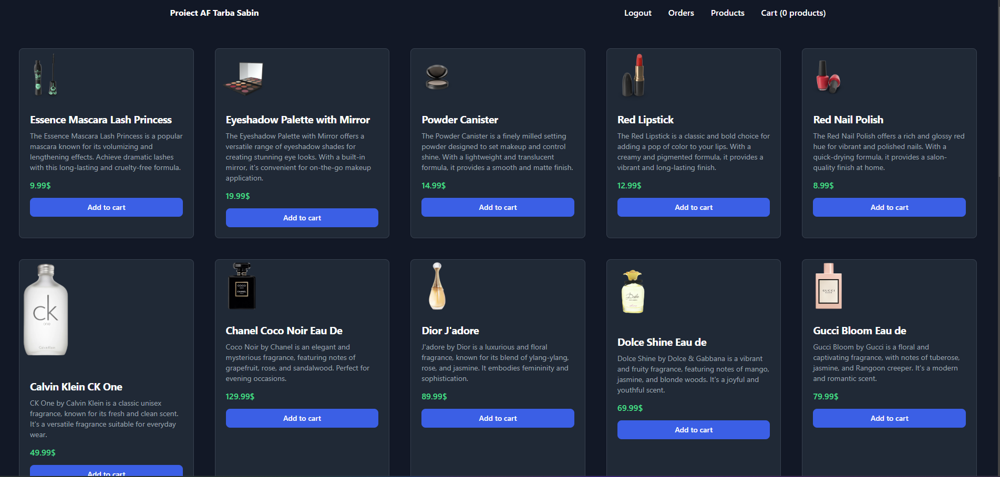
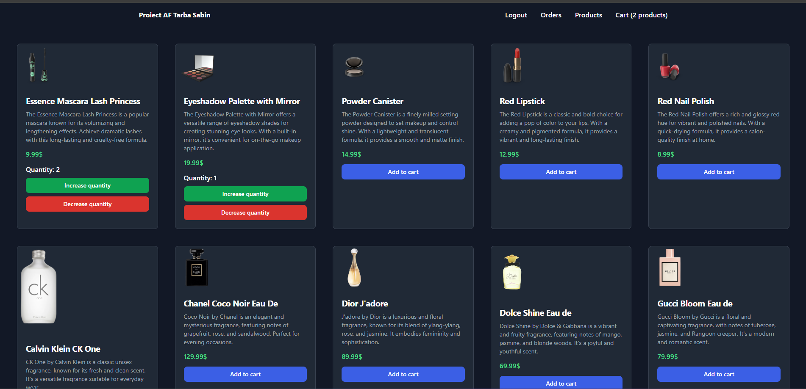
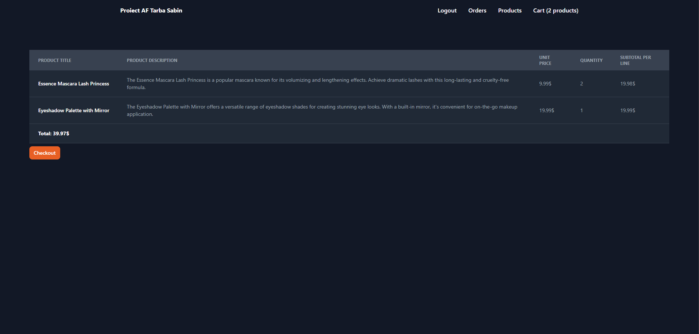
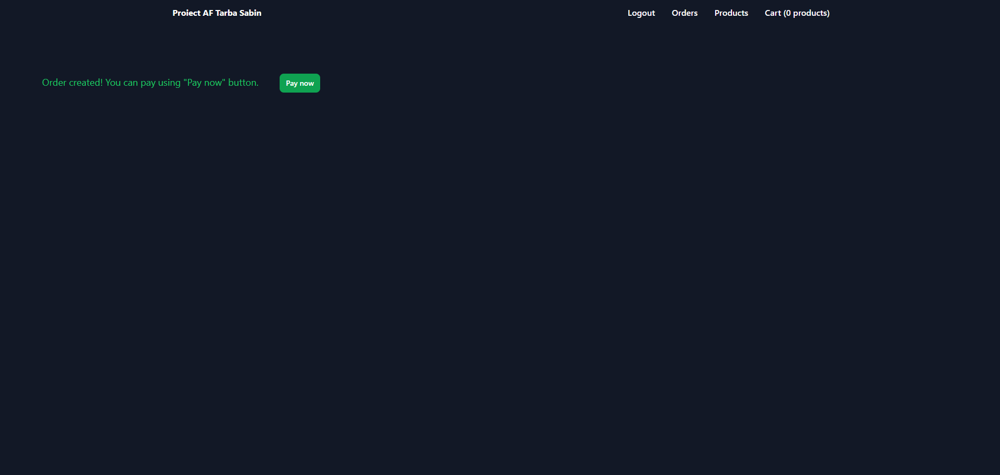
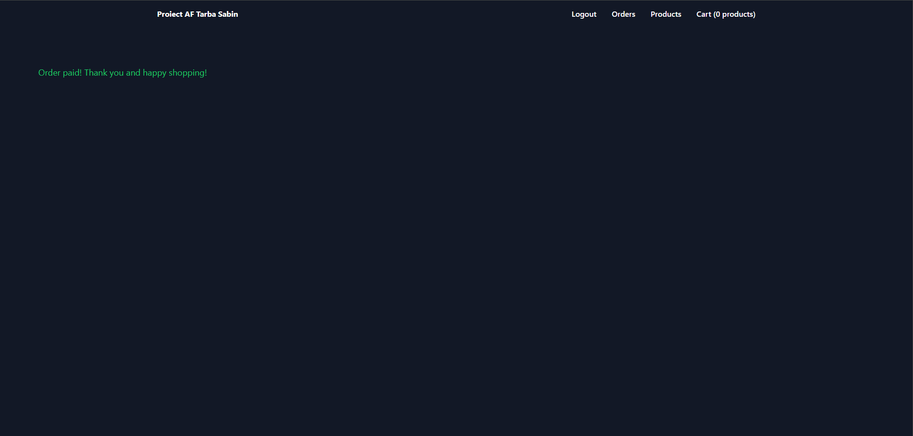
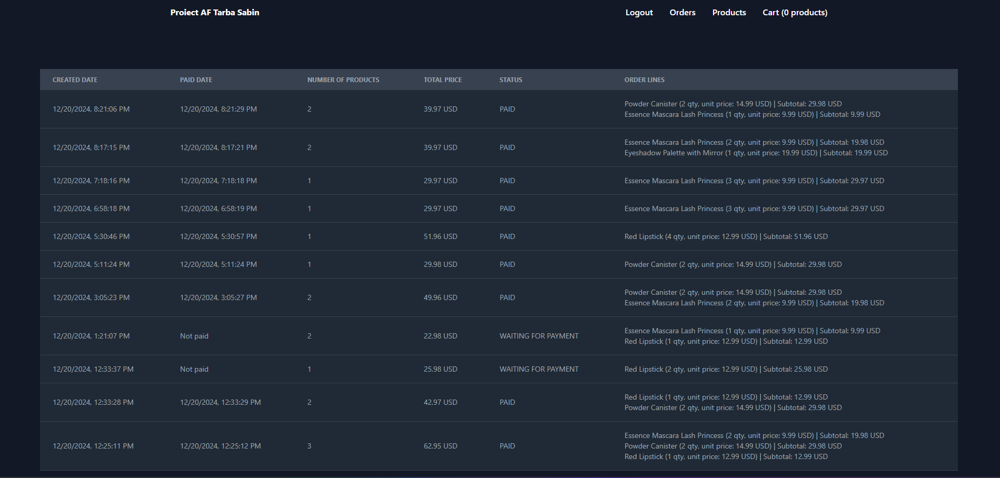

# Proiect Afaceri Electronice BDSA An 2024
# Student Tarba Sabin

## Tehnologii folosite
* Pentru realizarea aplicatiei au fost folosite urmatoarele tehnologii:
    * `BackEnd`:
        * Baza de date: `SQLITE`
        * Server: `NodeJS`
        * ORM: `Sequelize`
        * Testare BackEnd: `Postman`
        * Altele `DBeaver`
    * `FrontEnd`
        * SPA: `React`
        * CSS: `Tailwind`
        * Altele: `Redux`

## Functionalitatile aplicatiei
* `Register`
    * Se pot crea noi utilizatori direct din aplicatie. Pe pagina de Login exista posibilitatea navigarii pe pagina de Register prin butonul `Sign Up`.
    
    * In cazul in care o adresa de mail este deja folosita de utilizator atunci creare utilizatorului nu este efectuata si este afisat mesaj de eroare.
    
    * Creare utilizator cu succes
    

* `Login`
    * Autentificarea in aplicatiei se realizeaza pe baza email-ului si a parolei setate in pasul de inregistrare. Salvarea sesiunii este persistenta la refresh si pentru autentificarea request-urilor este folosit un token JWT care este salvat in local storage.
    

* `Produse`
    * Dupa login si la apasarea butonului `Produse` din navbar-ul aplicatiei este afisata lista cu produse disponibile. Produsele sunt preluate dintr-un API extern.
    
    * La apasarea butonului `Add to card` produsul este adaugat in cos si in partea dreapta a navbar-ului este actualizat contorul pentru numarul de produse. La click pe butonul `Increase quantity` si `Decrease quantity` cantitatea comandata din fiecare produs este actualizata
    

* `Cosul`
    * Dupa selectarea produselor folosind navbar-ul aplicatiei se poate ajunge in cosul de cumparaturi si produsele selectate pot fi vizualizate, precum si totalul. Salvarea cosului este persistenta la nivel de baza de date. La logout cosul nu este sters si este disponibil utilizatorului la urmatoarea autentificare.
    

* `Plasarea si plata comenzii`
    * Dupa vizualizarea produselor se poate confirma comanda prin butonul `Checkout` si se poate efectua plata prin butonul `Pay now`
    
    
    
    * Dupa finalizarea comenzii produsele din cos sunt automat eliminate

*  `Vizualizare comenzilor`
    * Dupa plasarea comenzilor si confirmarea sau/si plata lor, istoricul acesta este disponibil in meniul dedicat. Comenzile pot avea doua statusuri:
        * `PAID` - plata a fost efectuata
        * `WAITING FOR PAYMENT` - plata nu a fost efecuata si este in asteptare
    

*  `Logout`
    * La logout token-ul JWT este sters automat din local storage si se poate relua procesul de autentificare.

## Rularea aplicatiei pe local

```bash
1. git clone https://github.com/SabinTarba/proiect-af proiect_af
2. cd proiect_af/frontend
3. npm i
4. cd proiect_af/backend
5. npm i
6. vi proiect_af/frontend/.env si completare
REACT_APP_API_BASE_URL=<REPLACE_BE_API_BASE_URL>
REACT_APP_PRODUCTS_API_URL=<REPLACE_JSON_PRODUCTS> (eg: 'https://dummyjson.com/products')
7. vi proiect_af/backend/.env si completare
PORT=<REPLACE_BE_PORT>
TOKEN_SECRET=<REPLCAE_JWT_TOKEN_SECRET>
WEB_REACT_APP_BASE_URL=<REPLACE_REACT_APP_BASE_URL>
8. cd proiect_af/frontend && npm start
9. cd proiect_af/backend && npm run dev
10. ENJOY!
```

### Sursa aplicatie
* Aplicatia poate fi gasita pe github-ul personal accesand: `https://github.com/SabinTarba/proiect-af`